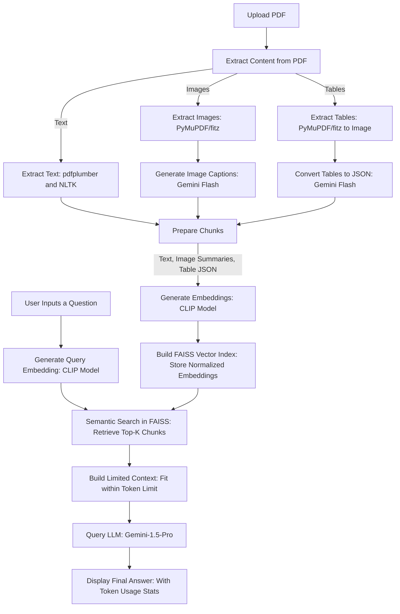

# 📚 Multimodal RAG Chatbot 🔍 🤖 — Powered by Gemini 1.5 + CLIP
Welcome to **Deepan's Multimodal RAG Chatbot**, a lightweight, efficient Retrieval-Augmented Generation (RAG) chatbot that supports complex PDF containing Text, Tables, and Images.
This app uses the power of Google Gemini 1.5 Pro, OpenAI CLIP embeddings, and FAISS for multimodal document search and generation.

🔗 Hosted on GitHub: [DeepK-art/Multimodel-RAG](https://github.com/DeepK-art/Multimodel-RAG.git)

---

## 🚀 Features
- 📄 Upload and process PDFs containing text, tables, and images

- 📊 Extract tables as structured JSON using Gemini

- 🖼️ Extract and caption images via Gemini multimodal reasoning

- 🧠 Embed all content (text + captions + table summaries) using CLIP embeddings

- 📚 FAISS vector store for fast semantic search

- 💬 Interactive Streamlit chat interface with chat history memory

- 🤖 Contextual responses generated using Gemini 1.5 Pro

## 🧰 Tech Stack

The following table outlines the components and corresponding libraries/tools used in the multimodal RAG pipeline:

| Component              | Library/Tool                                    |
|-----------------------|-------------------------------------------------|
| User Interface        | Streamlit                                       |
| Text Extraction       | pdfplumber                                      |
| Table Extraction      | PyMuPDF (fitz) + Gemini                         |
| Image Handling        | PyMuPDF + Gemini                                |
| Embeddings            | OpenAI CLIP model (clip-vit-base-patch32)       |
| Vector Database       | FAISS                                           |
| LLM                   | Google Gemini API (1.5 Pro)                      |
| API Secrets           | dotenv (.env file for config)                   |
| Text Cleaning/Chunking | NLTK                                            |

## 📁 File Structure


## 🧪 How It Works
1. **Document Upload**
    Upload .pdf documents containing text, tables, and images.

2. **Multimodal Extraction**

   - Text extracted via pdfplumber

   - Tables extracted via PyMuPDF, then converted to JSON using Gemini

   - Images extracted and captioned via Gemini

3. **Embedding**
     All extracted content is embedded using OpenAI CLIP to create a unified multimodal representation.

4. **FAISS Indexing**
     Embeddings are indexed using faiss.IndexFlatL2 for fast retrieval.

5. **Retrieval and Generation**

    For each user query, the Top-3 relevant content chunks are retrieved from the FAISS DB.

    The query + retrieved context are sent to Google Gemini 1.5 Pro.

    Gemini generates a coherent final answer based on the context.





## 📝 Setup Instructions
### 1. Clone the Repository
``` bash
git clone https://github.com/DeepK-art/Multimodel-RAG.git
cd Multimodel-RAG
```

### 2. Create and Activate a Virtual Environment (Optional)
```bash
python -m venv venv
source venv/bin/activate  # On Windows: venv\Scripts\activate
```
### 3. Install Requirements
```bash
pip install -r requirements.txt
```
### 4. Run the Application
```bash
streamlit run app.py
```

### 🔐 Environment Variables
Create a .env file in the root of your project:

```bash

GEMINI_API_KEY=your_gemini_api_key_here
```
⚠️ The .env file is gitignored for safety reasons.

I have given the option for the user to manually enter their Gemini API key to the multimodel RAG 

### ▶️ Running the App
```bash
streamlit run app.py
```
The page opens with:

bash
Copy
Edit
Deepan's 🙂  Multimodal RAG Chatbot 🔍 🤖 
📎 Kindly upload a PDF file containing text, tables, or images for context
💡 Sample Workflow
Upload a PDF.

See extracted text, table JSONs, and image captions in the sidebar.

Click "📚 Process Files" to embed them.

Ask your question in the chat box.

Get a contextually relevant answer generated via Gemini 1.5 Pro!

## 🧪 Example Use Cases
Understanding complex academic PDFs (research papers, reports)

Searching and answering from business reports with embedded tables and images

Building domain-specific personal AI knowledgebases

## 🛠️ Troubleshooting
Gemini API issues?

Check API key and usage limits at Google AI Studio.

FAISS errors?

Prefer running in Linux or WSL for compatibility.

Streamlit not updating?

Try refreshing (Ctrl+R) or restart the app.

## 🙏 Acknowledgements
OpenAI (CLIP Model)

Google (Gemini Models)

Streamlit Team

Facebook Research (FAISS)

PyMuPDF, pdfplumber Libraries

## 📜 License
Unlicensed

## 🤝 Contributing
Pull requests, ideas, and feature suggestions are most welcome!
Just fork the repo, make your improvements, and raise a PR.

## 👋 Author
Deepan


